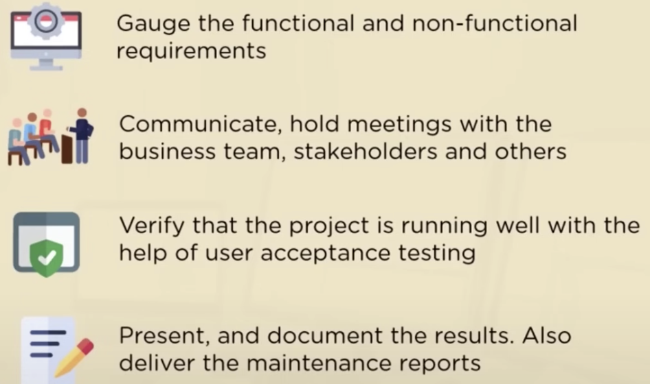

## Business_Analyst_For_Beginners

- 1.The steps to ensure the smooth delivery of the project
- 2.Responsibilities of a Business Analyst
- 3.Skills Required
- 4.Business Analysis Knowledge Areas
- 5.Agile 
- 6.Scrum Methology

### 1. The steps to ensure the smooth delivery of the project

Use a example to get deeper understand for those steps:
Client <u>Rob</u> want to get help from <u>Business Analyst Angela</u> to help him creat an E-commerce app for selling electronic devices.

- 1.1Understand the Business Objectives
  
- 1.2Gather Requiements
  
- 1.3Allocate Resources
  
- 1.4Provide Suggestions
  
- 1.5Collect Feedback
  
- 1.6Build Reports
	
- 1.7Conduct Meetings
	
- 1.8Documentation and Presentation
	

### 2. Responsibilities of a Business Analyst

### 3.Skills Required

3.1 Understanding the Business objective

3.2 Analytical & Critical thinking
Evaluating several options before arriving at the desired solution

3.3 Communication & Interpersonal Skills
Listing, Reading, Writing skills are very critical
Facilitating meetings as well. Must be able to clearly convey their idea

3.4 Negotiation & Cost-benefit analysis

3.5 Decision-Making Skills
Taking crucial decision for the company
Problem-solving skills.  Have a knack to think out of the box find a solution to problems

3.6 Programming languages

3.7 Creation of Reports and Dashboards

3.8 Database and SQL

3.9 MS Excel

3.10 Documentation & Presentation
BA must be able to document and record project learnings and results in a concise way

### 4. Business Analysis Knowledge Areas

### 5. Agile 

#### 5.1 What is Agile: **Agile is a set of Values and Principles**
- Agile is a set of beliefs that teams can use for making decisions about how to do the work.
- Agile's real utility is giving people a commn fundation for making decisions about the best way to develop software
- Making each decision based on the principles and values that the team has decided to follow
- Simply trying to mimic another team's actions and practices won't make your team Agile

 #### 5.2. What is Agile: Agile is not a Methodology

- Agility is the ability to continually adapt, the ability to constantly make improvements to the way work.
- [12 Values and principles](https://www.agilealliance.org/agile101/12-principles-behind-the-agile-manifesto/)

Agile is an <u>incremental</u> and <u>iterative</u> software development idea where the complete development process is divided into multiple sub-modules

### 6. Scrum Methology

Scrum is an agile framework for collaborating developing and delivering complex products of the highest possible value

### 7. The difference between BA and DA

7.1 <u>BA</u> is the perfessional bridge between IT and Business teams, they use technology to solve business problems and propose data-driven advice.

- Identify the business objectives
- Work with the development team
- Asses the functional and non-functional requirements. Perform user acceptance testing
- Present and document the results

7.2 DA gathers and processes large datasets, After which, they analyse the collected data to unravel useful business insights.

- Understand the requirements 
- Collect data through querying
- Perform data filtering and cleaning. Remove invalid data
- Formulate and present the outcome 
