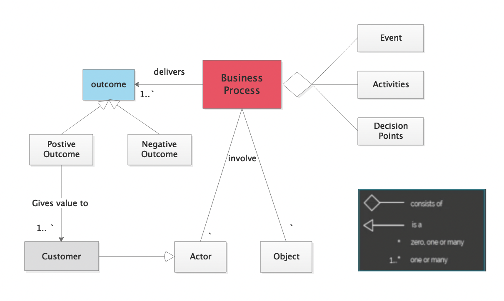
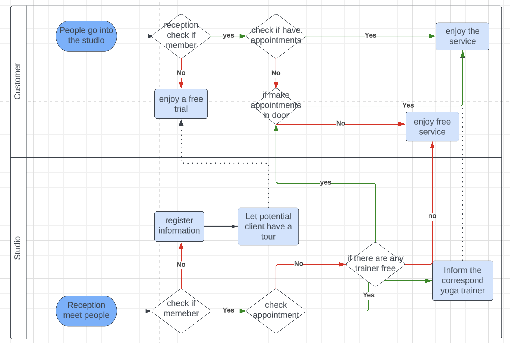
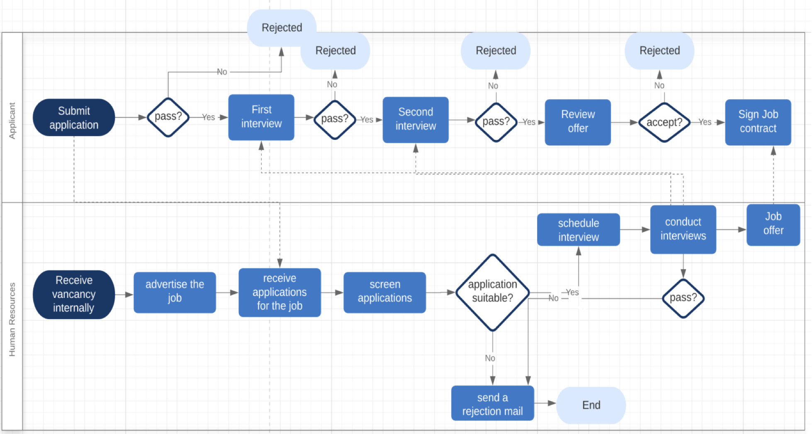
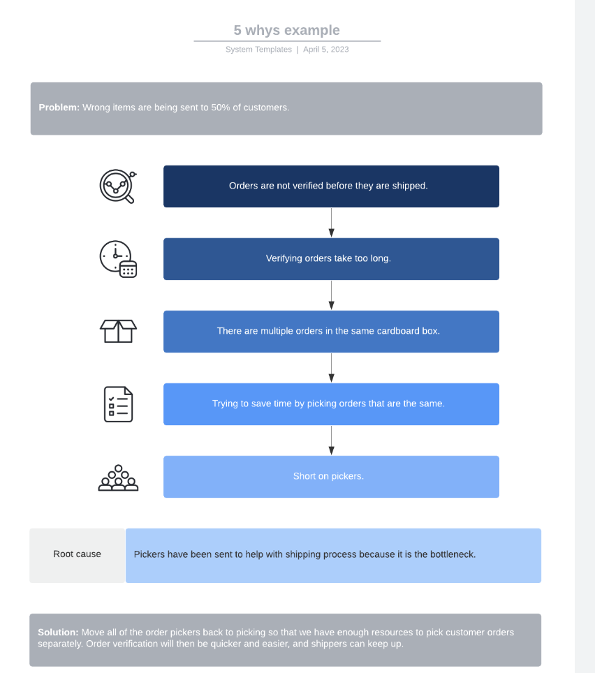
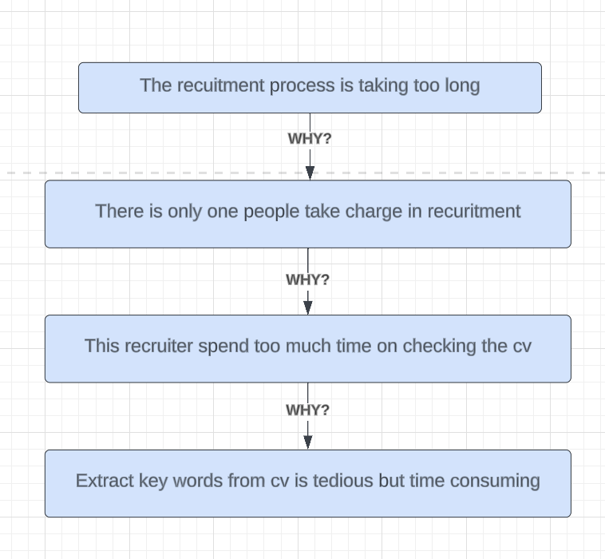
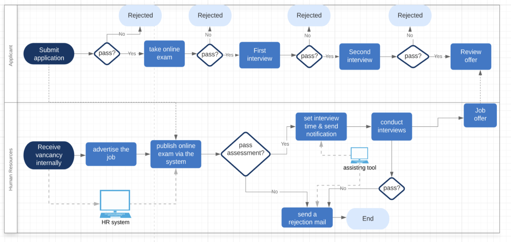

### BusinessAnalysis&ProgressManagement

1. For each task I will be displayed a pre established case study and then I will asked to do the similar/same for the current project.
2. Case study: 
   - Online boutique concept
   - A yoga studio is looking for a new yoga studio

## 1. Step for <u>identifying business</u> needs

### Define your business

- 1.1 What are the products and/or services offered?
- 1.2 Who are the trget customers?
- 1.3 What are your strategic goals?
- 1.4 Where are you now in achieving your goals?
- 1.5 What is your current status in the market?

## 2. Recognize Business Process

#### 2.1 Any business consist of a <u>combination of business process</u> which is simply a <u>set of interrelated</u> tasks or activities that <u>achieve a certain goal</u>.

**2.2 The simple Fulfill Process:**
1Purchase order received

2Confirm order
3Get shipment address
4Ship product
5Emit invoice
6Receive payment
7Archive order

8Order fulfilled

**2.3 Stakeholders**

A party that has an interest in a company and can either affect or be affected by the business.
<u>Investors, employees, customers, and suppliers</u>

**2.4 Business models**

- Business process model
  
  
- Recruitment model
  The process starts with **receiving the vacancy information internally** then **advertising** the job after collecting applications for the job, **screening** is done to categorize the applications into suitable or not suitable. For suitable applications, **interviews** are scheduled for the applicants and if applicants pass the first interview they move to the **second interview** and if they passed the second interview they get accepted and they **get a job offer**.
  

### **2.5 Analysis & Evaluate Recruitment model **
How to evaluate business problems from a process view.
Assess whether the process achieves its goal or not

Look back at the original goal

- 5 whys to analysis why the problem cause
  

**Assume ** There is only one human representative in yoga studio responsible for the recruitment process. Accordingly, the process is taking too long to complete and the yoga teachers persists.

**How to improve**:

- Introduce a HR system to check and extract key words from CV outmatically.

- Adding a online test in case they pass the first screening decision, this is followed by interviews.
- And the notification and rejection emails can be send automatically by system.

### Summary:

- The first step to approach any business analysis scenario is developing a clear **<u>business identity</u>**
- Identifying business problems is the core of business analysis.
- Basic business needs are often based on
- Any business must have one or more business processes
- Business process is a set of interrelated tasks that achieve a certain business goal 
- A business process flowchart starts and ends with a Terminator
- Swimlanes: To specify the entities responsible for each part of the process
- What is the first step in analyzing a business process:

